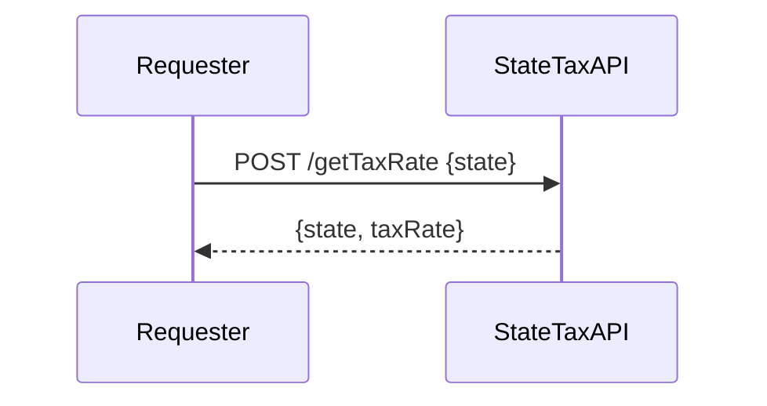
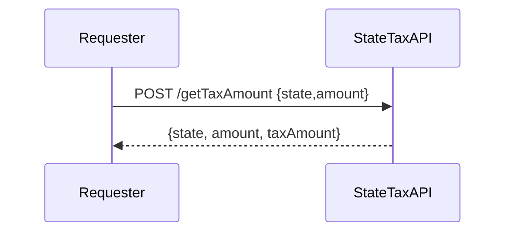
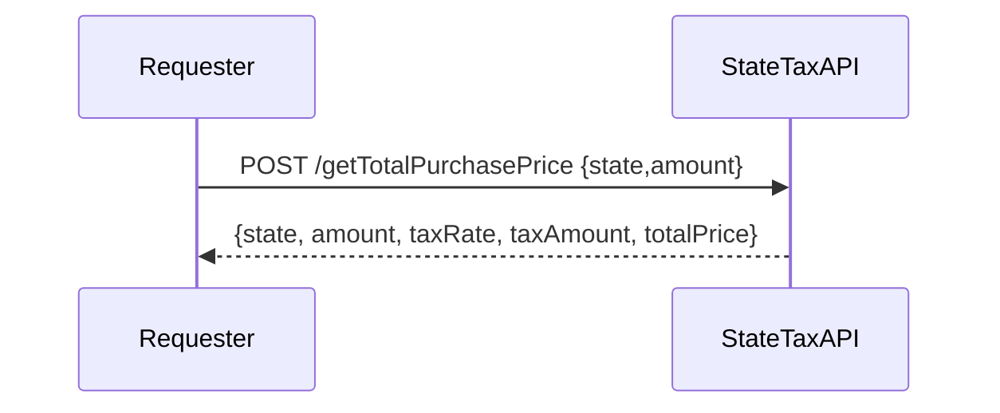

# State Tax API
The state tax API microservice communicates over HTTP requests.  
There are three distinct endpoints which provide varying granularity of tax information  
- **/getTaxRate** returns the tax rate for a given state
- **/getTaxAmount** returns the price of the tax for a given state and item price
- **/getTotalPurchasePrice** returns all of the above data as well as the total price of an item (with state tax applied)  
  
If required payload data is missing when a request is recieved, the service will respond with a 400 status code and an error message detailing the missing data along with the request body.  
If data for a state is requested that there is not data for, the service will respond with a 404 along with a message explaining the issue and the request body.  
<br />
*All endpoints expect payload data as a JSON object*  
<br />
# Endpoints:  
## /getTaxRate
Method : POST  
Payload :  
- state (2-char state abbreviation)
  
Returns:
- state (2-char state abbreviation)  
- taxRate (state tax rate as decimal value)
  
python example request:
```python CODE title
import requests

#Make POST request with appropriate data payload
response = requests.post('https://statetaxapi.onrender.com/getTaxRate',
  json = {'state': 'OR'})

print(response.json()) # print out the entirety of the response as JSON
print (f"Tax Rate  : {response.json()['taxRate']} ") # Access taxRate from JSON response 
```

## /getTaxAmount
Method : POST  
Payload : 
- state (2-char state abbreviation)
- amount (item price in USD)
  
Returns:
- state (2-char state abbreviation)
- amount (item price in USD)
- taxAmount (amount of tax applied to item)

python example request:
```python
import requests

#Make POST request with appropriate data payload
response = requests.post('https://statetaxapi.onrender.com/getTaxAmount',
  json = {'state': 'CA','amount':1.5})

print(response.json()) # print out the entirety of the response as JSON
print (f"Tax Rate  : {response.json()['taxAmount']} ") # Access taxAmount from JSON response 
```

## /getTotalPurchasePrice
Method : POST  
Payload : 
- state (2-char state abbreviation)
- amount (item price in USD)
  
Returns:
- state (2-char state abbreviation)
- amount (item price in USD)
- taxAmount (amount of tax applied to item)
- taxRate (state tax rate as decimal value)
- totalPrice (purchase price of item = item price + tax)
  
python example request:
```python
import requests

#Make POST request with appropriate data payload
response = requests.post('https://statetaxapi.onrender.com/getTotalPurchasePrice',
  json = {'state': 'WA','amount':1.5})

print(response.json()) # print out the entirety of the response as JSON
print (f"Total Price : {response.json()['totalPrice']} ") # Access totalPrice from JSON response 
```

